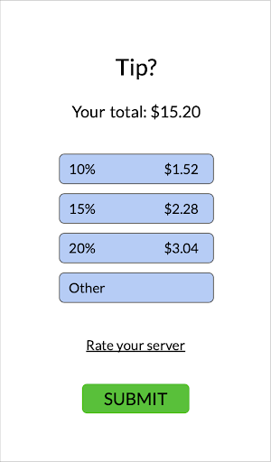
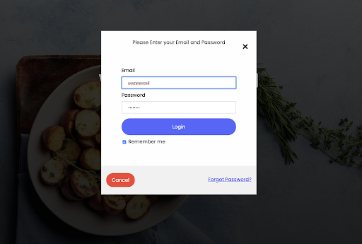

# Team MECS (Build) - Final Report

## Problem and Motivation

Current methods of paying the check at a restaurant can be quite frustrating. The process itself may seem simple, but it’s actually rather unsophisticated and inefficient. One must first wait for the waiter to bring the bill, then wait for them to come back and take your credit card, then complete the purchase at the register, and then bring your card back to you. It’s such an easy process, yet it often takes an annoyingly long time. Such inefficiencies are magnified when eating a meal with a large group of family or friends, in which multiple parties are involved in paying the bill.

One option is to have a single person pay, and then the others pay them back through Venmo or with cash, but this is not an effective solution. College students are particularly hesitant to put one card down and commit to paying a large lump sum of money at one time, especially since they could lose money from others not reimbursing them. The other option is to have the waiter split the check evenly based on the number of members in the group. This also poses quite a few issues since everyone orders different items, so some people will end up overpaying for their meal. We believe this problem could be made drastically simpler, and more efficient through technology, allowing customers of all restaurants to pay instantly and evenly, while never having to worry about splitting checks or unnecessarily losing money.

---

## Related Work

There are a variety of platforms which offer services to address many of the same problems we hoped to address with our app. One of these platforms is Venmo, a popular app which acts as a mobile wallet and allows users to easily transfer funds to one another (Figure 1). This makes the process of paying each other back after going out to eat in a large group much easier to facilitate. However, it does not include any automatic splitting features which many find frustrating to do manually. While Venmo provides features that are helpful for eating in large groups today, our goal is to design an app which includes additional features to make the customer’s experience even simpler.

*Figure 1: The Venmo homepage*

In October 2019, American Express rolled out bill splitting capabilities with contacts using PayPal and Venmo, which allows cardholders to split pending and posted transactions with up to 20 people (Figure 2). Additionally, the in-app split feature allows users to split the bill in any fashion, even accounting for tips and other fees that may not be included in the transaction amount. While American Express’s attempt at solving this problem is certainly one to build upon, it still falls short: one person must still put the charge on their American Express card (if they have one), and it then sends out the Venmo requests to each individual user. At its core, it automates the process of sending out multiple Venmo requests.

*Figure 2: American Express bill splitting feature*

---

## User Research

Through our research, we hoped to learn the general desire and need for a new bill-payment system. We interviewed two fellow college students, and asked them questions like, “How often do you eat in a large group?” and “How do you currently handle splitting the bill?” We also interviewed one restaurant owner and one restaurant employee and asked each of them questions such as, “What is your restaurant’s policy on split checks?” and “How do you feel about splitting checks for large parties?” We felt these questions would allow us to gain a better understanding of the opinions surrounding paying the bill and splitting checks from both the consumer and restaurant perspectives. We also observed a large group eating at Cozy Noodles & Rice, a restaurant which does not allow split checks. We wanted to understand how the group interacted during the bill paying process, as well as observe their solution to splitting the bill amongst themselves. We took this approach as we felt it was balanced in that we asked specific people from both sides of the bill-paying process how they felt about it, as well as observed a real-world example of the action we hope to improve.

After completing our user research, we decided to focus on two main target user populations: college students, ranging from 18 to 22 years old, and restaurant owners, managers, and employees. These two classes come together through basic interactions in restaurants. From our interviews with college students, it became clear that our app would need to include features that automatically calculate each person’s individual bill, as well as keep each person accountable for paying their own total. From discussing pain points with the restaurant owner and employee, we decided that our solution must make the splitting process quicker for the servers, while avoiding an overhaul of the restaurant’s current technology. User personas for these two target populations we envision using our app can be seen in Figures 3 and 4 below.

*Figure 3: College student user persona*

*Figure 4: Restaurant owner user persona*

---

## Paper Prototyping

During the testing of our paper prototype, we tested five main tasks:
1) Enter in your table’s pin
2) Select the items you ordered (split a meal with a friend)
3) Change your payment method to Venmo
4) Add a tip
5) Send receipt to your email

Our paper prototype reflected key features we hoped to implement in our final prototype. We designed our paper prototype to resemble a phone screen, assuming this style would be the most intuitive for users to interact with. Screenshots of our paper prototype can be seen below in Figures 5-10.

  
   
  

<i markdown="1">Figures 5-7: “Enter PIN” page, meal selection page, and tip page</i>

  
   
  

<i markdown="1">Figures 8-10: Payment methods page, receipt page, and confirmation page</i>

The concept of our app was taken very well by users who tested our paper prototype. With college students being one of our two target user populations, we decided to test our paper prototype with several Northwestern students. Many of them expressed similar frustrations and experiences as students we had interviewed, and were excited by the idea of an app to help address these inefficiencies.

While leading users through tasks, we ran into two main usability problems. The first was when users were tasked with splitting a meal with a friend. Our initial idea was to have users hold down the meal they wish to split, in which case splitting options would pop up on the screen. After testing this feature, we realized that many users struggled with this task and the screen-holding method was not intuitive enough. The next usability problem we found occurred when users were tasked with adding a tip. We had designed our paper prototype such that once a user selects their meals on one page and clicks “I’m Done,” a tip page would appear. Many users were unsure whether they needed to add a tip before clicking “I’m Done,” and attempted to click buttons on the screen until realizing the tip page was separate.

We implemented two main features to address these usability problems in our next rounds of computer prototyping. To address the confusion surrounding the split-meal feature, we added a three-dot symbol next to each meal choice. This symbol universally represents “additional options,” so we figured it was the most intuitive solution. In order to address the usability problems in adding a tip, we ultimately decided to combine the meal selection and tip pages into just one main page. This way, users won’t wonder whether they need to add a tip before or after moving on from the meal selection page. Overall, we received valuable feedback while testing our paper prototype which helped guide the design of many of the features we implemented in our final prototype.

---

## High-Fidelity Prototyping

*Tasks*

Throughout our three rounds of computer prototyping, we implemented the following tasks:

1) A home page which prompt users to either:
   - Log into an existing account
   - Register for a new account
2) Enter Bill PIN

*Figures 11-13: Login/Signup Page, Login Form, and Bill PIN page*

After looking closely at existing tech solutions with one administrator (in this case, the server) and multiple users (or consumers), we settled on the Kahoot! model: the organizer can give all users an access code for a seamless and fast experience. In our web app, users will create an account in order to store their billing preferences, and from that point on, all they will ever need to do to access their table’s receipt is enter the Bill PIN, as shown in Figure 13.

3) Select the item(s) that you ordered at the meal,
4) Split a meal in half
5) Add a tip for your server
6) Switch payment methods

*Figure 14: Meal select page*

*Figure 15: New payment method*

*Figure 16: Custom tip seletor*

In order to support tasks 3-6, we configured one central dashboard, which is where most of our work was done. We set up a grid layout so users can handle all tasks as they move from left to right on the screen, as shown in Figure 14. In the central region of the page, users can select a meal they ordered one by one or even click the half meal button. In the rightmost region of the page, users can handle tasks 5 and 6, where they can choose one of the standard tips or even opt to enter a customer tip as seen in Figure 16, which we implemented after user feedback in discussion sections. Once ready to pay, a user can either leave the default payment setting of Venmo or choose to enter a new payment method which causes a new popup to display seen in Figure 15.

7) Finish and Pay

*Figure 17: Confirmation Screen*

To support the very last task, we implemented a confirmation screen where users can choose to receive their receipt by email or text message, or select to enter a new Bill PIN.

*Components*

**Data Collection**: Our app featured several instances of data collection components. The sign up form contains 4 text inputs from the user (full name, email, phone number and password), as well as a check-box question, asking if the user wishes to save their information for their next login. The text inputs have numerous restrictions: users’ emails must contain an “@” symbol, for example. If one of these conditions are not met, there is an alert that prompts the user to make any necessary adjustments. Another example of a data collection component is when the user creates a new payment method on the meal select page, where a field appears with input validation functions on the credit card input.

**Data Visualization**: On the meal select page, there is a dynamic table total tracker that will update upon every meal selected to show the user how close the table is to completing the bill. This tracker shows the relationship between food selected/paid for and the total bill amount. As the user selects which item(s) they ordered, the bar raises to represent their share of the bill. Additionally, as the user selects item(s) and adds a tip, the total that they are paying increases and is displayed on screen.

**User Profiles**: In order to implement the User Profiles component, we created a login feature that allows a user to enter their credentials. Once logged in, our app features two different Bill PIN screens for two hard-coded users with different names and images appearing on the page specific to each user.

---

## Reflection

Over the past ten weeks, our team was able to create a product that satisfies essentially all of our envisioned necessary tasks. Taking a step back, we wanted to create an app that helped facilitate the bill-paying process for groups. Although there are various routes in which one can attempt to solve this central issue, we believe to have crafted an app that is a genuine and viable attempt at resolving this transactional inefficiency. The basic idea of our app is a platform for customers and restaurants to interact and generate/pay personalized individual bills, without any extra effort on the side of the waiter. 

During our first week of developing our app, we focused on selecting a general design format that we would be comfortable applying throughout our entire product, as well as some basic functional tasks for users. These tasks involved allowing the user to select to either “Log In” or “Sign Up” for a new account. Both of these prompts would invite the user to enter their information, with some basic input validation on their emails, password and phone numbers. Following this task, the now-logged-in user is prompted to enter their “Bill-Pin”, a unique set of alphanumeric characters that their waiter will give them, granting them access to their table’s shared bill. This process was largely inspired by existing products, such as Kahoot and Survey Monkey that allow easy access to personal elements within a website, given a randomly generated access code. In the following stage, we generated our first draft of the main functionality of our app, a page in which users can select and pay for their individual meal items. With their “Bill-Pin”, logged-in users can select the items they wish to pay for individually, add a personalized tip, and then finally submit their payment. In the last week of adjusting to user feedback, we made some final modifications to our main screen, in order to optimize the usability of our product. These edits included some minor bug fixes, the ability to pay for only half of a meal, the ability to switch a user’s payment option, a custom tip option, as well as a confirmation screen that allows the user to ensure that their payment has been received.

Overall, although we managed to create a product that was almost identical to the one our group had initially planned, we seamlessly responded and adapted based on our results and observations from user testing. Although we are extremely proud of our finished product, given more time, we would have liked to implement some additional features. The next steps of our app would have surely included more dynamic elements, allowing for more a more personal user experience on our app. We believe that the real efficiencies from this app would be enjoyed if restaurants were able to effortlessly upload their menu data to our product, via some sort of publicly-accessible API. Our group looked into accessing the APIs of food-delivery systems such as Uber-Eats and Postmates, since many restaurants have already uploaded their menu items, with associated prices, to such platforms. However, the APIs of these platforms were unavailable, we were left with simply having to hard code some fake menu items, with reasonable prices.

---

## Links

**Team Repository**: [https://github.com/HCI-Build/build-app](https://github.com/HCI-Build/build-app)

**Working Prototype**: [https://hci-build.github.io/build-app/](https://hci-build.github.io/build-app/)

**Viewing Instructions**: This application should currently be tested using Chrome on a laptop or desktop computer.